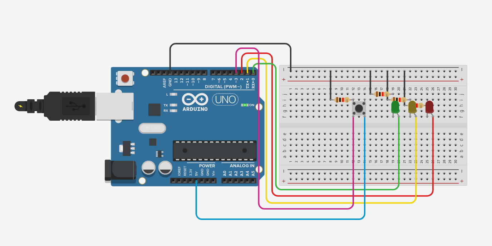

# Ponderada-Arduino-Semaforo Caua Pirilo Asquino

<div align="center">
      <small><strong style="font-size: 12px;"></strong></small><br>
      <br>
      <small style="margin-top: 4px; font-size: 10px;"></small><br>
</div>

<div align="center">
  <!-- Use relative path so the video works on GitHub Pages and local file:// previews -->
  <video src="./videoArduino.mp4" controls width="1000">
    Seu navegador não suporta vídeos. Você pode baixar ou abrir o arquivo diretamente: <a href="./videoArduino.mp4">Abrir vídeo</a>
  </video>
</div>
Eu coloquei nos arquivos um video do Arduino funcionando, porem se nao funcionar segue link do [tinkercad](https://www.tinkercad.com/things/kCecpKZWOt5-arduino-semaforo)

```
// Classe que representa um semáforo
class Semaforo {
  private:
    int pinoVermelho;
    int pinoAmarelo;
    int pinoVerde;

  public:
    Semaforo(int vermelho, int amarelo, int verde) {
      pinoVermelho = vermelho;
      pinoAmarelo = amarelo;
      pinoVerde = verde;
    }

    void iniciar() {
      pinMode(pinoVermelho, OUTPUT);
      pinMode(pinoAmarelo, OUTPUT);
      pinMode(pinoVerde, OUTPUT);
      apagarTudo();
    }

    void apagarTudo() {
      digitalWrite(pinoVermelho, LOW);
      digitalWrite(pinoAmarelo, LOW);
      digitalWrite(pinoVerde, LOW);
    }

    void vermelho() {
      apagarTudo();
      digitalWrite(pinoVermelho, HIGH);
    }

    void amarelo() {
      apagarTudo();
      digitalWrite(pinoAmarelo, HIGH);
    }

    void verde() {
      apagarTudo();
      digitalWrite(pinoVerde, HIGH);
    }

    void finalizou() {
      for (int i = 0; i < 3; i++) {
        digitalWrite(pinoVermelho, HIGH);
        digitalWrite(pinoAmarelo, HIGH);
        digitalWrite(pinoVerde, HIGH);
        delay(500);
        apagarTudo();
        delay(500);
      }
    }

    void sequencia() {
      verde();
      delay(3000);

      amarelo();
      delay(1000);

      vermelho();
      delay(3000);

      finalizou();
      apagarTudo();
    }
};

// Instância do semáforo nos pinos
Semaforo semaforo(2, 1, 0);
const int pinoBotao = 3;

// Variável de controle
bool podeRodar = false;

void setup() {
  semaforo.iniciar();
  pinMode(pinoBotao, INPUT_PULLUP);
  semaforo.apagarTudo();

  // Aguarda o botão estar solto antes de permitir a ativação
  while (digitalRead(pinoBotao) == LOW) {
    // Esperando o usuário soltar o botão
  }
}

void loop() {
  // Verifica se o botão foi pressionado
  if (digitalRead(pinoBotao) == LOW && podeRodar == false) {
    podeRodar = true;  // Habilita a sequência

    semaforo.sequencia(); // Executa a sequência completa

    podeRodar = false; // Desabilita novamente
    // Aguarda soltar o botão antes de permitir nova ativação
    while (digitalRead(pinoBotao) == LOW) {
      delay(10);
    }
  }
}

```

